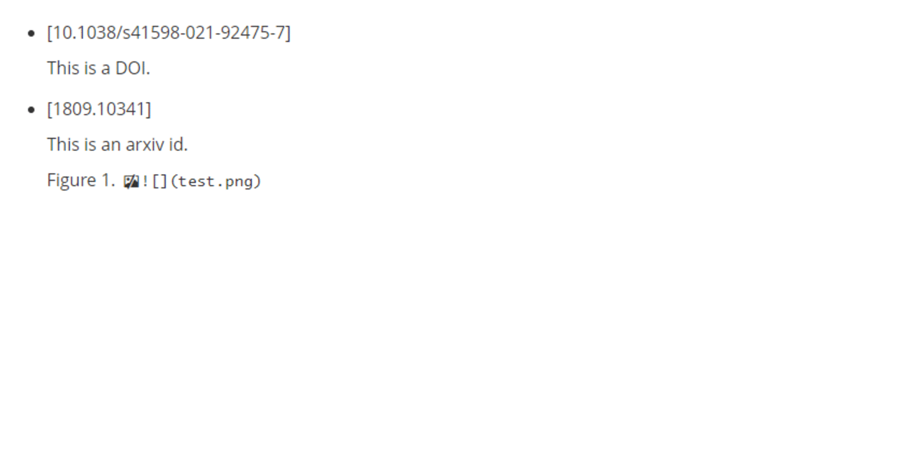

# autoLiterature
**autoLiterature**是一个基于Dropbox和Python的自动文献管理器。Inspired by [MU LI](https://www.bilibili.com/video/BV1nA41157y4). 



**麻烦使用[该邀请链接Dropbox](https://www.dropbox.com/referrals/AADHfuWXiW9pgDQs2L1aWAjUILZWznjXs2U?src=global9)注册Dropbox帐号，邀请者和被邀请者帐号都会增加一些空间。**

## 特点
- 自动抓取文献元信息，并下载文献
- 自动上传文献到Dropbox，并生成Dropbox分享链接
- 自动上传文献笔记中链接到的本地图片到Dropbox，并生成分享链接替换笔记中的本地链接
- 将上述内容写入到笔记中相应的位置


## 安装
1. 下载软件
```bash
git clone 
cd autoliterature
```

2. 安装依赖项
```bash
conda create -n autoliter python  # 新建一个conda环境
conda activate autoliter  # 激活环境
pip install -r requirements.txt  # 安装依赖项
```
### 软件参数
```bash
(autoliter) */autoliterature$ python main.py -h
usage: main.py [-h] [-p ROOT_PATH] [-o OUTPUT] [-k DROPBOX_ACCESS_TOKEN] [-t INTERVAL_TIME]

autoLiterature

optional arguments:
  -h, --help            show this help message and exit
  -p ROOT_PATH, --root_path ROOT_PATH
                        The path to the folder.
  -o OUTPUT, --output OUTPUT
                        The path to save the pdf format file.
  -k DROPBOX_ACCESS_TOKEN, --dropbox_access_token DROPBOX_ACCESS_TOKEN
                        https://www.dropbox.com/developers/documentation/python#tutorial
  -t INTERVAL_TIME, --interval_time INTERVAL_TIME
                        The interval time for monitoring folder.
```

## 使用
1. 获得Dropbox API 的 **access token** 
    1. 注册[Dropbox](https://www.dropbox.com/referrals/AADHfuWXiW9pgDQs2L1aWAjUILZWznjXs2U?src=global9), 在[App Console](https://www.dropbox.com/developers/apps)注册一个新的应用。
    2. 进入应用中，选择`Permissions`选项，将`Files and folders`权限开到最大，比如勾上`files.metadata.write`, `files.content.write`, `sharing.write`, `file_requests.write`, `contacts.write`. 
    3. 选择应用中的`Settings`，勾选`Access token expiration`-->`No expiration`, 然后点`Generated access token` 生成一个永久**Access token**
2. 选择一个存放**文献笔记**的文件夹作为程序监视对象，比如`./note`, 选择一个文件夹用来存放本地pdf,比如`./pdf`, 选择监控频率`t s/epoch`
3. 运行程序
    ```
    python main.py -p ./note -o ./pdf -k your_access_token -t 1
    ```
    推荐后台运行
    ```
    # Linux
    nohup python main.py -p ./note -o ./pdf -k your_access_token -t 1 &

    #  Window
    pythonw main.py -p ./note -o ./pdf -k your_access_token -t 1 &
    ```
4. 在`./note`中新建Markdown文件做文献笔记  
    1. 当文档中出现`- [文献主页](文献主页)`，比如`- [https://arxiv.org/abs/1809.10341](https://arxiv.org/abs/1809.10341)`的时候，`autoLiterature`会自动抓取文献信息，以及pdf,并写入文献笔记。
    2. 当文献中出现``的时候，`autoLiterature`会将本地图像推送到Dropbox，并生成共享链接来替换本地链接。

## 其它
### TODO
- [metadata extracter](publisher_list.md)

### 不足
**不支持~文档保存怪~使用：**
- 目前仅支持采取：修改文献笔记-->保存-->等待`autoLiter`完成更新文献笔记-->修改笔记；
- 不支持：修改文献笔记-->保存-->修改文献笔记-->保存-->修改-->等待`autoLiter`完成更新文献笔记；

